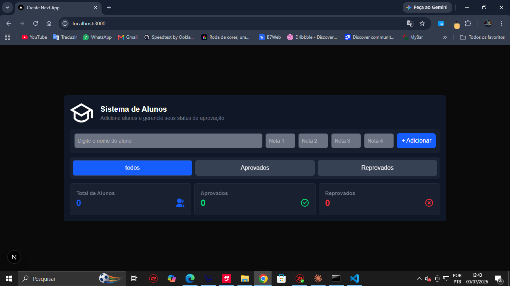
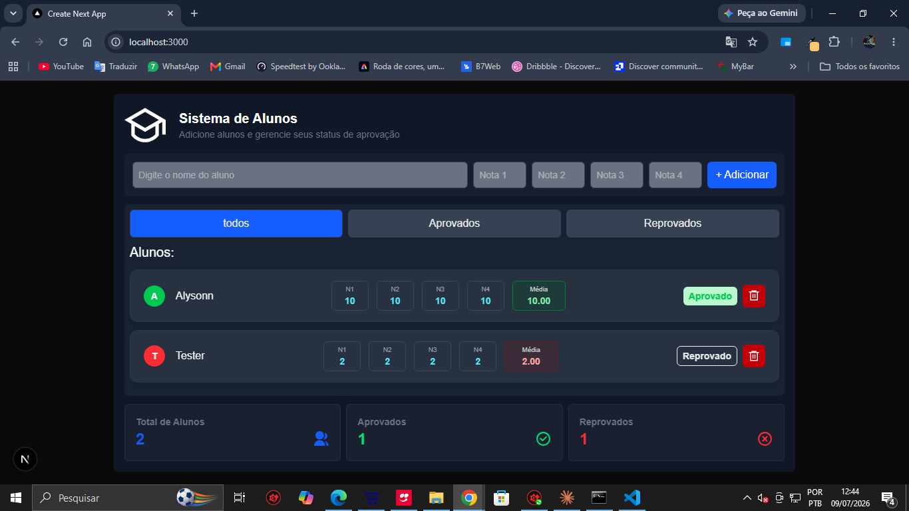
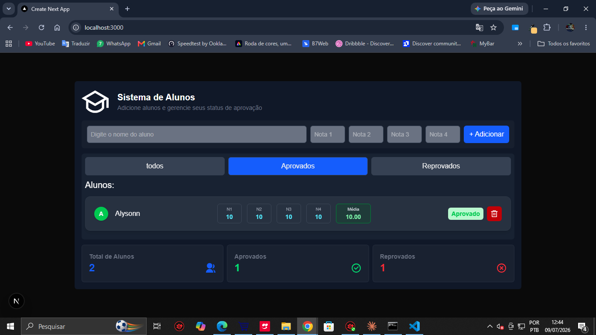
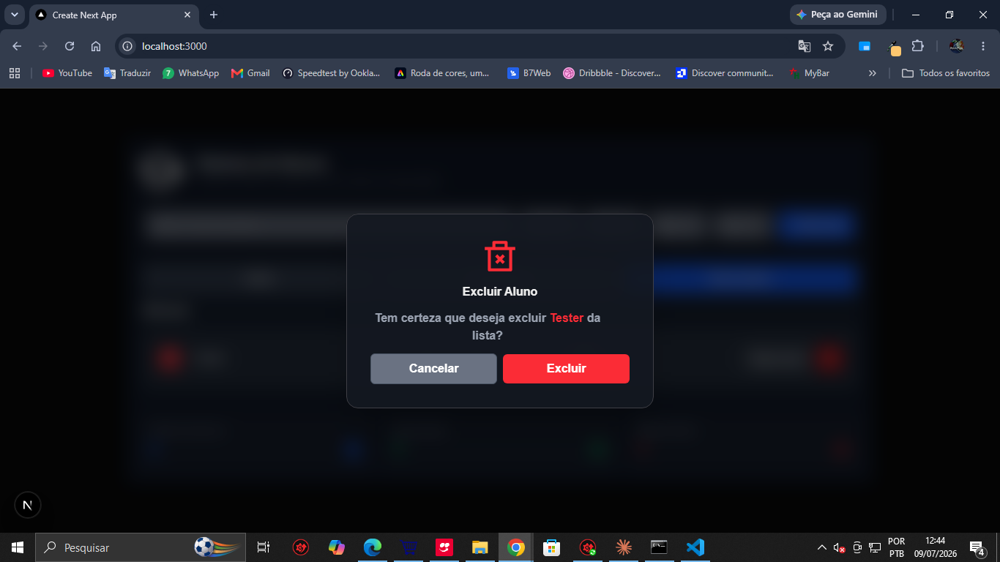
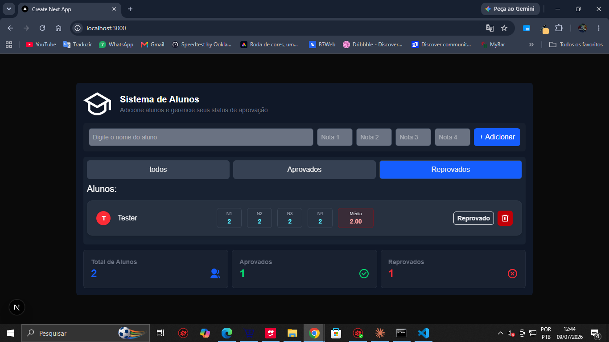

## Sistema de Gestão de Alunos

Aplicação web para gerenciamento de alunos, com cadastro, cálculo automático de média, filtros de aprovação/reprovação e componentes reutilizáveis.

Projeto desenvolvido como parte da minha formação Full Stack, aplicando na prática conceitos de React, TypeScript e componentização.

✨ Funcionalidades

Cadastro de alunos com formulário multi-campo e validação
Cálculo automático de média e status (aprovado/reprovado)
Filtros de listagem por status
Modal de confirmação antes de excluir um registro
Componentes reutilizáveis (Header, Input, FilterTabs, ListItem, DeleteModal, entre outros)

🚀 Tecnologias

Next.js
TypeScript
Tailwind CSS

📦 Como rodar o projeto

bash# Clone o repositório
git clone https://github.com/Alysonn-Vinicius/sistema-gestao-alunos.git

# Acesse a pasta do projeto
cd sistema-gestao-alunos

# Instale as dependências
npm install

# Rode o projeto em ambiente de desenvolvimento
npm run dev

O projeto estará disponível em http://localhost:3000.

📁 Estrutura do projeto

.
├── app/                  # Páginas e rotas do Next.js App Router
│   ├── globals.css       # Estilos globais
│   ├── layout.tsx        # Layout compartilhado
│   ├── page.tsx          # Página principal
│   └── src/              # Arquivos auxiliares usados pelo app
├── public/               # Arquivos estáticos
├── src/                  # Código-fonte principal
│   ├── componentes/      # Componentes reutilizáveis
│   ├── data/             # Dados e fixtures
│   └── types/            # Tipagens TypeScript
├── package.json          # Metadados e scripts do projeto
├── tsconfig.json         # Configuração do TypeScript
├── next.config.ts        # Configuração do Next.js
└── README.md             # Documentação do projeto

🖼️ Screenshots

👤 Autor
Alysonn Vinicius

GitHub: @Alysonn-Vinicius
LinkedIn: alysonn-vinicius